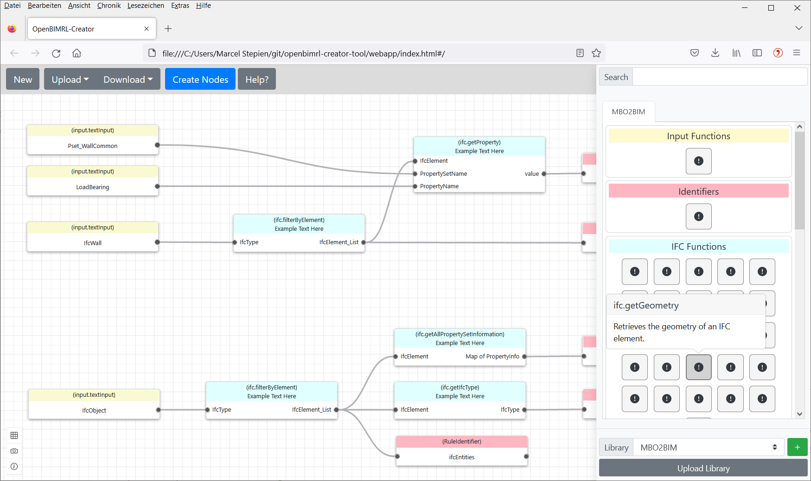

# OpenBimRL Creator-Tool

> **Current Version:** 2022.11.1 <br>
> **Publication Date:** 01.06.2022 <br>
> **Updated Date:** 01.11.2022 <br>
> **Autors:** Marcel Stepien <br>
> **E-Mail:** marcel.stepien@ruhr-uni-bochum.de
<br>


A web-based application to create and edit OpenBimRL files. 

## Getting started

To run this project, following applications must be installed:

- node.js
- npm
- Visual Studio Code (Recommended) + Vetur plugin for Vue


The following dependencies have to be installed using npm:


```shell
npm install
```

For more details on dependencies view the package.json file.

# Compiling and Running

New client side implementations can be added by writing code in: /webapp/src/
New server side implementations can be added by writing code in: express-server-run.js

In order to bundle Vue components into a single app.js file, the code has to be compiled using laravel-mix and watch. The files will be stored in */webapp/dist/*. These files are used by the index.html file. To generate the compiled files, simply run following command:

```shell
npm run watch
```

**NOTE:** Executing watch will install additional packages. You may need to run it again afterwards. If errors accure run *npm install* to fix them. The watch-mode supports hot-reload, in order to edit and view files live in a browser. 

Additionally, the server can be used to execute the environment and serving the webapp. Simply run:

```shell
node express-server-run.js
```

Exiting a running server or watch-mode: **STRG + C**


# Run Demo without Coding

**This tool also runs without the sever application!** Simply run the index.html from the webapp-folder in your web-browser to execute and use the latest updated version of this tool.




Alternativly the application can be run as an electon app:

```shell
npm run start
```